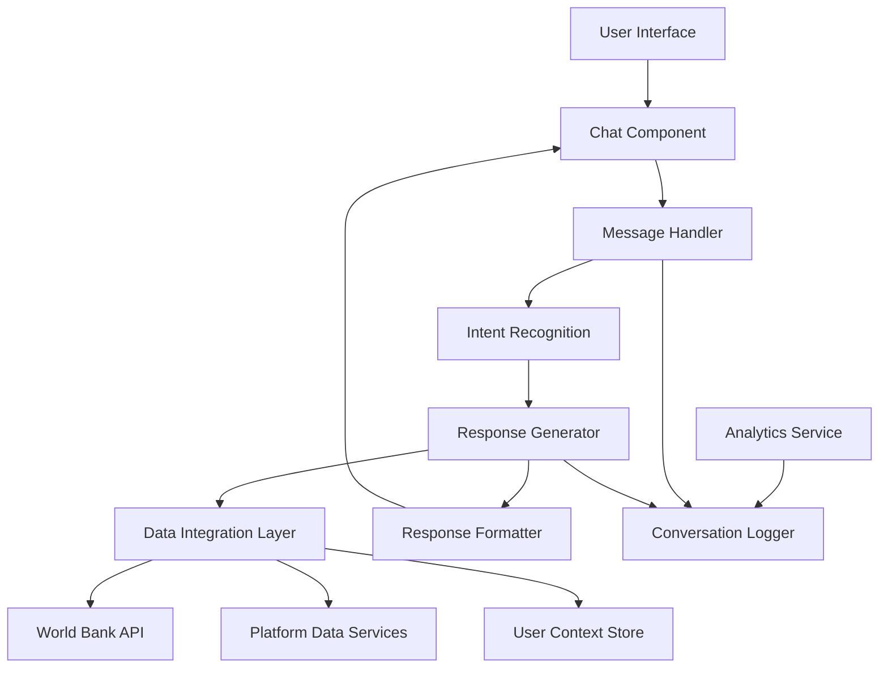

# AI-Powered Export Assistant Design Document

## Overview

The AI-Powered Export Assistant is a conversational interface that provides intelligent, context-aware assistance to ExportGuide users. The system combines natural language processing, integration with existing platform data services, and user behavior tracking to deliver personalized export guidance and platform navigation assistance.

## Architecture

### High-Level Architecture



### Component Architecture

The assistant will be built as a modular system with the following layers:

1. **Presentation Layer**: React-based chat interface
2. **Business Logic Layer**: Intent recognition and response generation
3. **Data Integration Layer**: Connections to existing APIs and services
4. **Persistence Layer**: User context and conversation history storage
5. **Analytics Layer**: Usage tracking and performance monitoring

## Components and Interfaces

### 1. Chat Interface Component (`ChatAssistant.tsx`)

**Purpose**: Main UI component for the conversational interface

**Key Features**:
- Floating chat widget with expand/collapse functionality
- Message history display with typing indicators
- Quick action buttons for common tasks
- Voice input support (future enhancement)

**Props Interface**:
```typescript
interface ChatAssistantProps {
  userId: string;
  userProfile: UserProfile;
  onNavigate: (page: string, params?: any) => void;
  isVisible: boolean;
  onToggle: () => void;
}
```

### 2. Message Handler Service (`MessageHandler.ts`)

**Purpose**: Processes incoming messages and coordinates response generation

**Key Methods**:
- `processMessage(message: string, context: UserContext): Promise<AssistantResponse>`
- `handleQuickAction(action: QuickAction, context: UserContext): Promise<AssistantResponse>`
- `getConversationHistory(userId: string): Promise<ConversationMessage[]>`

### 3. Intent Recognition Engine (`IntentRecognizer.ts`)

**Purpose**: Analyzes user messages to determine intent and extract entities

**Supported Intents**:
- `FIND_BUYERS`: User wants to discover potential buyers
- `MARKET_RESEARCH`: User needs market data or analysis
- `COMPLIANCE_HELP`: User has regulatory questions
- `QUOTATION_HELP`: User wants to create or manage quotes
- `PLATFORM_NAVIGATION`: User needs help using platform features
- `GENERAL_EXPORT_ADVICE`: User has general export questions
- `ONBOARDING_HELP`: New user needs guidance

**Entity Extraction**:
- Countries and regions
- Product categories and HS codes
- Industry sectors
- Monetary amounts and currencies

### 4. Response Generator (`ResponseGenerator.ts`)

**Purpose**: Creates contextual responses based on recognized intents and available data

**Response Types**:
- Text responses with embedded actions
- Data visualizations (charts, tables)
- Step-by-step guidance
- Platform navigation suggestions
- Quick action buttons

### 5. Data Integration Service (`AssistantDataService.ts`)

**Purpose**: Integrates with existing platform services to provide real-time data

**Integrated Services**:
- World Bank API for trade statistics
- Existing market research services
- User profile and preferences
- Platform usage analytics
- Cached data from previous queries

### 6. User Context Manager (`UserContextManager.ts`)

**Purpose**: Maintains conversation context and user preferences

**Context Data**:
- Current conversation thread
- User business profile (industry, target markets)
- Previous interactions and preferences
- Current platform session state
- Personalization settings

## Data Models

### Core Data Structures

```typescript
interface ConversationMessage {
  id: string;
  userId: string;
  timestamp: Date;
  type: 'user' | 'assistant';
  content: string;
  intent?: RecognizedIntent;
  metadata?: MessageMetadata;
}

interface RecognizedIntent {
  name: string;
  confidence: number;
  entities: ExtractedEntity[];
  parameters: Record<string, any>;
}

interface AssistantResponse {
  text: string;
  quickActions?: QuickAction[];
  dataVisualization?: DataVisualization;
  navigationSuggestion?: NavigationAction;
  followUpQuestions?: string[];
}

interface UserContext {
  userId: string;
  conversationId: string;
  businessProfile: BusinessProfile;
  currentSession: SessionContext;
  preferences: UserPreferences;
  conversationHistory: ConversationMessage[];
}

interface QuickAction {
  id: string;
  label: string;
  action: 'navigate' | 'search' | 'create' | 'analyze';
  parameters: Record<string, any>;
  icon?: string;
}
```

### Business Profile Integration

```typescript
interface BusinessProfile {
  industry: string;
  primaryProducts: string[];
  targetMarkets: string[];
  experienceLevel: 'beginner' | 'intermediate' | 'advanced';
  preferredLanguage: string;
  businessSize: 'small' | 'medium' | 'large';
}
```

## Error Handling

### Error Categories

1. **Intent Recognition Failures**
   - Fallback to general help responses
   - Ask clarifying questions
   - Provide topic suggestions

2. **Data Service Failures**
   - Graceful degradation with cached data
   - Clear error messages to users
   - Alternative data source suggestions

3. **Context Loss**
   - Conversation recovery mechanisms
   - Session state restoration
   - User preference backup

### Error Recovery Strategies

- **Retry Logic**: Automatic retry for transient failures
- **Fallback Responses**: Pre-defined responses for common failure scenarios
- **User Feedback**: Allow users to report issues and provide alternative phrasing
- **Escalation**: Option to connect with human support for complex issues

## Testing Strategy

### Unit Testing

- **Intent Recognition**: Test accuracy with various phrasings and languages
- **Response Generation**: Verify appropriate responses for each intent type
- **Data Integration**: Mock API responses and test error handling
- **Context Management**: Test conversation state persistence and retrieval

### Integration Testing

- **End-to-End Conversations**: Test complete user journeys
- **Platform Integration**: Verify navigation and feature integration
- **Performance Testing**: Response time and concurrent user handling
- **Cross-Browser Testing**: Ensure compatibility across different browsers

### User Acceptance Testing

- **Usability Testing**: Real users testing conversation flows
- **Accuracy Testing**: Verify response relevance and helpfulness
- **Accessibility Testing**: Screen reader and keyboard navigation support
- **Mobile Testing**: Responsive design and touch interactions

## Performance Considerations

### Response Time Optimization

- **Intent Caching**: Cache common intent patterns
- **Data Prefetching**: Anticipate likely data needs based on conversation context
- **Lazy Loading**: Load conversation history incrementally
- **Response Streaming**: Stream long responses for better perceived performance

### Scalability

- **Stateless Design**: Enable horizontal scaling of response generation
- **Database Optimization**: Efficient storage and retrieval of conversation data
- **CDN Integration**: Cache static assets and common responses
- **Rate Limiting**: Prevent abuse and ensure fair resource usage

## Security and Privacy

### Data Protection

- **Conversation Encryption**: Encrypt stored conversation data
- **PII Handling**: Identify and protect personally identifiable information
- **Data Retention**: Implement conversation data lifecycle management
- **User Consent**: Clear privacy policies and data usage consent

### Access Control

- **User Authentication**: Integrate with existing auth system
- **Session Management**: Secure session handling and timeout
- **API Security**: Secure communication with backend services
- **Input Validation**: Sanitize and validate all user inputs

## Accessibility

### WCAG Compliance

- **Keyboard Navigation**: Full keyboard accessibility for chat interface
- **Screen Reader Support**: Proper ARIA labels and semantic markup
- **Color Contrast**: Ensure sufficient contrast for all text elements
- **Focus Management**: Clear focus indicators and logical tab order

### Inclusive Design

- **Multiple Input Methods**: Text, voice, and quick actions
- **Language Support**: Multi-language capability with translation
- **Cognitive Accessibility**: Clear, simple language and visual cues
- **Motor Accessibility**: Large touch targets and gesture alternatives