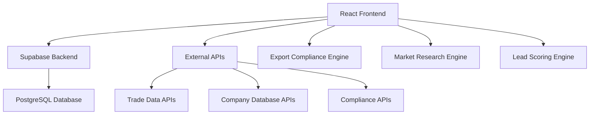

# Design Document

## Overview

The Export Guide application will be built as an extension of the existing ExportGuide platform, leveraging the current React/TypeScript/Material-UI stack with Supabase backend. The system will integrate export compliance checking, market research capabilities, and enhanced lead generation tools while maintaining the existing sales funnel workflow.

## Architecture

### High-Level Architecture



### Technology Stack

- **Frontend**: React 19, TypeScript, Material-UI v7
- **Backend**: Supabase (PostgreSQL, Auth, Real-time)
- **External Integrations**: 
  - Trade data APIs (UN Comtrade, World Bank)
  - Company databases (D&B, ZoomInfo)
  - Export compliance databases (BIS, OFAC)
- **Charts/Analytics**: Recharts
- **State Management**: React hooks with local state

## Components and Interfaces

### Core Components

#### 1. Export Compliance Module
- **ComplianceChecker**: Validates products against export control lists
- **RegulationDisplay**: Shows relevant export regulations by country
- **LicenseRequirements**: Displays licensing requirements and guidance
- **ComplianceAlerts**: Real-time notifications for regulation changes

#### 2. Market Research Module
- **MarketAnalyzer**: Analyzes target markets with trade statistics
- **TariffCalculator**: Calculates duties and trade barriers
- **MarketOpportunityFinder**: Identifies high-potential markets
- **CompetitorAnalysis**: Enhanced competitor research with export focus

#### 3. Enhanced Lead Generation Module
- **ExportLeadGenerator**: Finds international prospects with export capacity
- **LeadQualifier**: Scores leads based on export readiness
- **MarketSegmentation**: Segments leads by geographic and industry criteria
- **ComplianceScreening**: Screens leads against restricted party lists

#### 4. Analytics and Reporting Module
- **ExportDashboard**: Performance metrics for export activities
- **MarketPenetrationAnalyzer**: Tracks market share and growth
- **ComplianceReporting**: Audit trails and compliance reports
- **ROICalculator**: Calculates export opportunity ROI

### Database Schema Extensions

#### New Tables

```sql
-- Export compliance tracking
CREATE TABLE export_regulations (
  id SERIAL PRIMARY KEY,
  country_code VARCHAR(3),
  product_category VARCHAR(100),
  regulation_type VARCHAR(50),
  requirements TEXT,
  license_required BOOLEAN,
  updated_at TIMESTAMP DEFAULT NOW()
);

-- Market research data
CREATE TABLE market_opportunities (
  id SERIAL PRIMARY KEY,
  country_code VARCHAR(3),
  product_category VARCHAR(100),
  market_size DECIMAL,
  growth_rate DECIMAL,
  tariff_rate DECIMAL,
  trade_barriers TEXT,
  opportunity_score INTEGER,
  created_at TIMESTAMP DEFAULT NOW()
);

-- Enhanced lead information
CREATE TABLE lead_export_data (
  id SERIAL PRIMARY KEY,
  lead_id INTEGER REFERENCES leads(id),
  import_capacity DECIMAL,
  export_experience VARCHAR(50),
  compliance_status VARCHAR(50),
  market_segment VARCHAR(100),
  opportunity_score INTEGER,
  created_at TIMESTAMP DEFAULT NOW()
);

-- Compliance screening results
CREATE TABLE compliance_screenings (
  id SERIAL PRIMARY KEY,
  lead_id INTEGER REFERENCES leads(id),
  screening_type VARCHAR(50),
  status VARCHAR(20),
  risk_level VARCHAR(20),
  notes TEXT,
  screened_at TIMESTAMP DEFAULT NOW()
);
```

#### Enhanced Existing Tables

```sql
-- Add export-specific fields to leads table
ALTER TABLE leads ADD COLUMN country_code VARCHAR(3);
ALTER TABLE leads ADD COLUMN industry VARCHAR(100);
ALTER TABLE leads ADD COLUMN annual_revenue DECIMAL;
ALTER TABLE leads ADD COLUMN import_volume DECIMAL;
ALTER TABLE leads ADD COLUMN compliance_cleared BOOLEAN DEFAULT FALSE;
```

## Data Models

### Core Interfaces

```typescript
// Enhanced Lead interface
export interface ExportLead extends Lead {
  country_code?: string;
  industry?: string;
  annual_revenue?: number;
  import_volume?: number;
  compliance_cleared?: boolean;
  export_data?: LeadExportData;
}

export interface LeadExportData {
  id: number;
  lead_id: number;
  import_capacity: number;
  export_experience: 'none' | 'limited' | 'experienced' | 'expert';
  compliance_status: 'pending' | 'cleared' | 'restricted' | 'denied';
  market_segment: string;
  opportunity_score: number;
}

export interface MarketOpportunity {
  id: number;
  country_code: string;
  product_category: string;
  market_size: number;
  growth_rate: number;
  tariff_rate: number;
  trade_barriers: string;
  opportunity_score: number;
}

export interface ExportRegulation {
  id: number;
  country_code: string;
  product_category: string;
  regulation_type: string;
  requirements: string;
  license_required: boolean;
  updated_at: string;
}

export interface ComplianceScreening {
  id: number;
  lead_id: number;
  screening_type: 'denied_party' | 'restricted_entity' | 'sanctions';
  status: 'clear' | 'flagged' | 'denied';
  risk_level: 'low' | 'medium' | 'high';
  notes: string;
  screened_at: string;
}
```

## Error Handling

### Compliance Error Handling
- **Regulation API Failures**: Graceful degradation with cached data
- **Screening Service Outages**: Queue screenings for retry
- **Data Validation Errors**: Clear user feedback with correction guidance
- **License Requirement Changes**: Immediate user notifications

### Data Integration Error Handling
- **External API Rate Limits**: Implement exponential backoff
- **Data Quality Issues**: Validation and cleansing pipelines
- **Network Connectivity**: Offline mode with sync capabilities
- **Authentication Failures**: Automatic token refresh with fallback

### User Experience Error Handling
- **Form Validation**: Real-time validation with helpful messages
- **Search Failures**: Alternative search suggestions
- **Export Restrictions**: Clear explanation of limitations
- **Performance Issues**: Loading states and progress indicators

## Testing Strategy

### Unit Testing
- **Compliance Logic**: Test export control list matching
- **Market Analysis**: Validate calculation algorithms
- **Lead Scoring**: Test scoring model accuracy
- **Data Validation**: Test input sanitization and validation

### Integration Testing
- **External API Integration**: Mock API responses for consistent testing
- **Database Operations**: Test CRUD operations with test data
- **Authentication Flow**: Test user permissions and access control
- **Real-time Updates**: Test Supabase real-time subscriptions

### End-to-End Testing
- **Complete Export Workflow**: From research to lead qualification
- **Compliance Checking Flow**: Full compliance verification process
- **Lead Generation Pipeline**: End-to-end lead discovery and scoring
- **Reporting Generation**: Complete analytics and report creation

### Performance Testing
- **Large Dataset Handling**: Test with thousands of leads and opportunities
- **API Response Times**: Ensure sub-second response times
- **Concurrent User Load**: Test multi-user scenarios
- **Database Query Optimization**: Monitor and optimize slow queries

### Security Testing
- **Data Encryption**: Verify sensitive data protection
- **Access Control**: Test role-based permissions
- **API Security**: Validate authentication and authorization
- **Compliance Audit**: Ensure audit trail completeness

## Implementation Considerations

### External API Integration
- **Rate Limiting**: Implement request throttling and caching
- **Data Freshness**: Balance real-time data with performance
- **Fallback Strategies**: Cached data when APIs are unavailable
- **Cost Management**: Monitor API usage and optimize calls

### Performance Optimization
- **Lazy Loading**: Load components and data on demand
- **Caching Strategy**: Cache frequently accessed compliance and market data
- **Database Indexing**: Optimize queries with proper indexes
- **Bundle Optimization**: Code splitting for faster initial load

### Scalability Planning
- **Horizontal Scaling**: Design for multiple server instances
- **Database Sharding**: Plan for data partitioning if needed
- **CDN Integration**: Serve static assets from CDN
- **Monitoring**: Implement comprehensive application monitoring