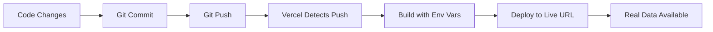

# 🔐 Vercel Environment Variables Setup for Real Data

## Overview
To enable real data in your deployed Export Guide app, you need to configure API keys in Vercel.

## 📋 Required Environment Variables

### 1. Go to Vercel Dashboard
1. Visit https://vercel.com/dashboard
2. Find your `export-guide` project
3. Click on it → Settings → Environment Variables

### 2. Add These Variables

#### **World Bank API** (Free - No Key Required)
```env
REACT_APP_WORLD_BANK_BASE_URL=https://api.worldbank.org/v2
```

#### **UN Comtrade API** (Free with Registration)
```env
REACT_APP_COMTRADE_API_KEY=your_comtrade_key_here
REACT_APP_COMTRADE_BASE_URL=https://comtradeapi.un.org/data/v1
```

#### **Trade.gov API** (Free with Registration)  
```env
REACT_APP_TRADE_GOV_API_KEY=your_trade_gov_key_here
REACT_APP_TRADE_GOV_BASE_URL=https://api.trade.gov/consolidated_screening_list/search
```

#### **Cache Configuration**
```env
REACT_APP_CACHE_TTL_HOURS=24
REACT_APP_MAX_CACHE_SIZE_MB=50
REACT_APP_ENABLE_REAL_DATA=true
REACT_APP_FALLBACK_TO_MOCK=true
```

## 🔑 How to Get API Keys

### UN Comtrade API
1. Go to https://comtradeapi.un.org/
2. Register for free account
3. Get your API key from dashboard
4. Free tier: 100 requests/hour

### Trade.gov API  
1. Go to https://api.trade.gov/
2. Register for free account
3. Get API key from developer portal
4. Free tier: 1000 requests/day

### World Bank API
- No registration required
- Free unlimited access
- Rate limit: 120 requests/minute

## 🚀 Deployment Process

### Step 1: Add Environment Variables
```bash
# In Vercel Dashboard:
# Settings → Environment Variables → Add New

Name: REACT_APP_COMTRADE_API_KEY
Value: your_actual_api_key_here
Environment: Production, Preview, Development
```

### Step 2: Redeploy
After adding environment variables:
1. Go to Deployments tab
2. Click "Redeploy" on latest deployment
3. Or push new code to trigger auto-deploy

### Step 3: Verify
1. Check your live app URL
2. Open browser dev tools → Network tab
3. Navigate to Market Research
4. Should see real API calls instead of mock data

## 🔍 Testing Real Data Integration

### Quick Test Checklist
- [ ] Dashboard shows real trade statistics
- [ ] Market research returns actual country data  
- [ ] Loading states work properly
- [ ] Error handling shows when APIs are down
- [ ] Cache prevents excessive API calls

### Debug Mode
Add this for debugging:
```env
REACT_APP_DEBUG_API_CALLS=true
```

## 🛡️ Security Best Practices

### ✅ Do's
- Store all API keys in Vercel environment variables
- Use different keys for development/production
- Monitor API usage quotas
- Implement rate limiting in your code

### ❌ Don'ts  
- Never commit API keys to Git
- Don't expose keys in client-side code
- Don't exceed API rate limits
- Don't store sensitive data in localStorage

## 🔄 Auto-Deploy Workflow



## 📊 Monitoring

### Check API Usage
- Monitor Vercel function logs
- Track API response times
- Watch for rate limit errors
- Monitor cache hit rates

### Performance Metrics
- Page load times with real data
- API response times
- Error rates
- User engagement with real vs mock data

## 🚨 Troubleshooting

### Common Issues

#### "API Key Invalid"
- Check environment variable spelling
- Verify key is active in API provider dashboard
- Ensure key has correct permissions

#### "Rate Limit Exceeded"  
- Implement request throttling
- Add caching to reduce API calls
- Consider upgrading API plan

#### "CORS Errors"
- Use server-side API calls
- Implement proxy endpoints
- Check API provider CORS settings

#### "Data Not Loading"
- Check network tab for failed requests
- Verify environment variables are set
- Test API endpoints directly

## 🎯 Success Indicators

When everything works correctly:
- ✅ Real market data displays on dashboard
- ✅ Market research shows actual trade statistics  
- ✅ Loading states appear during API calls
- ✅ Error messages show when APIs are unavailable
- ✅ Data updates reflect real-world changes
- ✅ Performance remains good with real data

Your Export Guide will transform from showing mock data to providing real, actionable business intelligence! 🌟